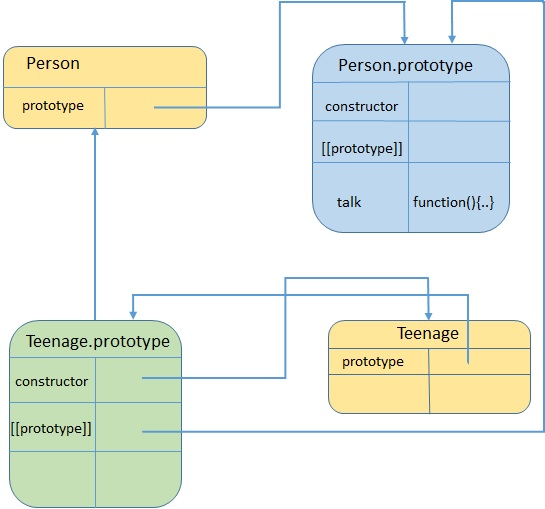

There are some very good tutorials on the web for the above topic (e.g. [MDN Inheritance](https://developer.mozilla.org/en-US/docs/Web/JavaScript/Inheritance_and_the_prototype_chain)).

I really recommend the great book of Stoyan Stefanov [JavaScript Patterns](http://shop.oreilly.com/product/9780596806767.do) which explains into more details practical patterns in JavaScript.

So after the long credits let's jump into business. I would like to elaborate on an interesting pattern, which i was not aware of... (shame on me) called 'A temporary constructor'.

When we talk about inheritance in JavaScript we need to get familiar with the prototypal nature of the language. JavaScript has one constructor (object) with a property linking to another object - **prototype**. Each prototype has it's own prototype.... and there you get **prototype chain**.

Let's explain it with some coding (i prefer to learn new staff with writing unit test for it, but that's to some other post...)


    (function(){
	    "use strict";
	    function Person(name, age){
		    this.name = name;
		    this.age = age || '4';
	    };
	    Person.prototype.talk = function(){
		    return "Hi There, my name is " + this.name;
	    };
	    Person.prototype.getAge = function(){
		    return this.age;
	    };
	    
	    function Teenage(name){
		    this.name = name;		    		   
	    };
	    Teenage.prototype = new Person();
	    Teenage.prototype.constructor = Teenage;
	    
		QUnit.module("Exploring Inheritance", {});
		QUnit.test("Calling inherited method", function(assert){
			var oMoti = new Teenage("Moti");
			assert.equal(oMoti.talk(), "Hi There, my name is Moti");
		});
		QUnit.test("Calling property of the prototype object", function(assert){
			var oMoti = new Teenage("Moti");
			assert.equal(oMoti.age, "4");	
		});
	}());


(some remark: i'm using [QUnit](https://qunitjs.com/), you can choose your favorite unit testing framework)

I started by creating a new object called oMoti. As you recall, every object has a link to it's prototype object. since oMoti has been created from the Teenage constructor function, it's prototype property will link to the Teenage.prototype object.
Teenage.prototype is an object that has been created from the Person constructor function and therefore it's prototype property is linked to the  Person prototype (cumbersome, i know... stay with me - there is a drawing)

 

Pretty simple, right? 
The thing you should take is that we reach our target of inheritance - object (Teenage) has inherited the behavior and the properties from Person. meaning that the following will work:


    console.log(oMoti.getAge());  // Will print 4


The drawback(s) of the above solution is that in order to initiate the Teenage prototype object we initiated a new instance of Person, meaning that the internal properties and methods of the Person has been linked to the new object.
Person object "exposes" itself with it's prototype object and the way we initiated the Teenage.prototype has broken that...

In order to fix that, we will use the "A Temporary Constructor" pattern. let's do some coding and i'll try my best to explain...


    (function(){
	    "use strict";
	    function Person(name, age){
		    this.name = name;
	    };
	    Person.prototype.talk = function(){
		    return "Hi There, my name is " + this.name;
	    };
	    Person.prototype.getAge = function(){
		    return this.age;
	    };
	    
	    function Teenage(name){
		    this.name = name;		    		   
	    };

	    function beget(proto){
	    	function F(){};
	    	F.prototype = proto;
	    	return new F();
	    };
	    Teenage.prototype = new beget(Person.prototype);
	    Teenage.prototype.constructor = Teenage;
	    
		QUnit.module("Exploring Inheritance - A temporary constructor", {});
		QUnit.test("Calling inherited method", function(assert){
			var oMoti = new Teenage("Moti");
			assert.equal(oMoti.talk(), "Hi There, my name is Moti");
		});
		QUnit.test("Calling property of the prototype object", function(assert){
			var oMoti = new Teenage("Moti");
			assert.equal(oMoti.age, undefined);	
		});
	}());


So, now the reused functionality is only being taken from the Prototype object of Person. as you can see in the second test, trying to access property from the Person object will result with undefined.

The beget function receives a prototype object and initialized a new object (without any new properties) where it's prototype is the input prototype object. any object created from Teenage will have link to the Teenage.protoype object which it's prototype property is linking to the Person prototype. With this chain of prototype we reach our goal of achieving (prototypical) inheritance.  
